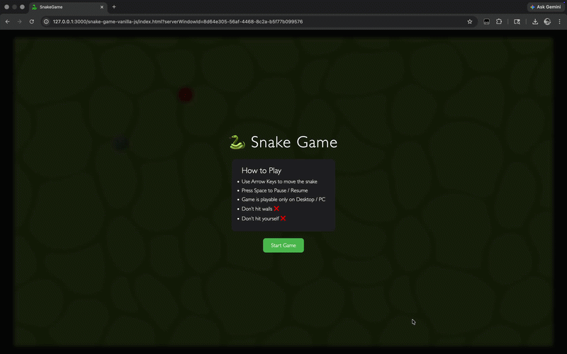

# 🐍 Snake Game

<p align="center">
  
  
  
  
</p>

## 🎥 Gameplay Preview

<p align="center">
  
</p>


## 🎮 About the Game

A classic Snake Game built using **HTML, CSS, and Vanilla JavaScript**.  
This project focuses on **game logic, DOM manipulation, and interactive UI design**.


## 🚀 Features

<p>
  
  
  
  
  
  
  
  
</p>


## 🎯 Controls

- ⬆️ ⬇️ ⬅️ ➡️ Arrow Keys → Move Snake  
- ⏸️ Space → Pause / Resume  
- 🔄 Restart Button → Restart Game  
- 💻 Game is playable only on **Desktop / PC**


## 🛠️ Tech Stack

<p>
  
  
  
</p>


## 🧩 Game Mechanics

- 🐍 Snake moves in grid-based system  
- 🍎 Food spawns at random positions  
- 📈 Snake grows on eating food  
- ❌ Game ends on:
  - Wall collision  
  - Self collision  
- 🏆 High score stored using **localStorage**


## 🎨 UI / UX Highlights

- 🐍 Styled snake with head, eyes & animations  
- 👅 Animated tongue effect  
- 🎬 Smooth movement using CSS transitions  
- 🪟 Overlay-based UI (Start + Game Over screens)  
- 🤖 Leveraged AI-assisted suggestions to refine UI styling and animations  


## 🚀 Run Locally

```bash
git clone https://github.com/your-username/snake-game.git
cd snake-game
open index.html
```

## 🧠 Learning Outcomes
<p>
  
  
  
  
  
</p>

## 👨‍💻 Author
<p>
  
</p>